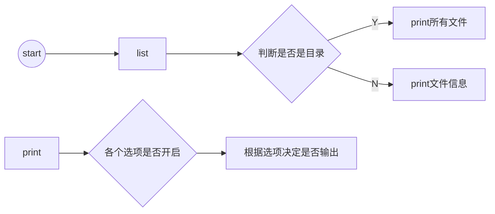

# linux 遍历文件目录
姓名：路修远 班级：2018211303 学号：2018211148

[TOC]

## 运行结果
> 这里由于中间命令的结果太长隐去了一些输出
```SHELL
travis@TravisLenovo:/mnt/c/Users/Travis/Documents/ShabbyToys/linux$ make
           13448  list
            3435  list.c
            1323  list.c.lnk
             227  makefile
              40  README.md
             372  report.md
travis@TravisLenovo:/mnt/c/Users/Travis/Documents/ShabbyToys/linux$ make test
./list -l 100 -h 5000 /bin /etc
            2140  bzcmp
            2140  bzdiff
            3642  bzegrep
            4877  bzexe
            3642  bzfgrep
            ...
            4942  wgetrc
            4096  xdg
             477  zsh_command_not_found
./list -a -r -l 50000 -m 2
./list -- -l
/mnt/c/Users/Travis/Documents/ShabbyToys/linux/-l: No such file or directory
./list *
              40  README.md
           13448  list
            3435  list.c
            1323  list.c.lnk
             227  makefile
             372  report.md
```

```makefile
# makefile
list : list.c
	@gcc list.c -o list
	@./list
	
.PHONY:clean
clean:
	@rm list

.PHONY:test
test:
	./list -l 100 -h 5000 /bin /etc
	./list -a -r -l 50000 -m 2
	./list -- -l
	./list *

.PHONY:deploy
deploy:
	sudo cp ./list /usr/bin
```


## 源代码

``` C
/**
 * @author Travis
 */
#include <dirent.h>
#include <stdio.h>
#include <stdlib.h>
#include <string.h>
#include <sys/stat.h>
#include <time.h>
#include <unistd.h>

#define TIME_S_PER_DAY 86400
#define MAXBUFSIZE 1024
#define file_color "\033[32;1m" // 绿色
#define dir_color "\033[34;42;1m" //绿色底色

int opt_a = 0, opt_r = 0, opt_g = 0, pathc = 0;
int opt_h = 0x3f3f3f3f, opt_m = 0x3f3f3f3f;
int opt_l = -1;

int* p_opt[6] = {&opt_a, &opt_r, &opt_m, &opt_l, &opt_h, &opt_g};

void usage() {
  printf(
      "LIST 1.0 by Travis, lxy2018montage@bupt.edu.cn, %s %s \
        \nUsage: list [OPTION]... [FILE]..., \
        \nList information about the FILEs (the current directory by default),\n \
        \n  -?        \tDisplay this help and exit, \
        \n  -a        \tDo not hide entries starting with .\
        \n  -r        \tList subdirectories recursively, \
        \n  -l <bytes>\tMinimum of file size, \
        \n  -h <bytes>\tMaximum of file size, \
        \n  -m <days> \tLimit file last modified time\n",
      __DATE__, __TIME__);
  exit(0);
}

void print(struct stat st, char* buf, char* filename, int is_dir) {
  time_t now = time(NULL);
  if (st.st_size > opt_l && st.st_size < opt_h &&
      (now - st.st_mtime) / TIME_S_PER_DAY < opt_m &&
      ((opt_a && '.' == filename[0]) || '.' != filename[0]))
    printf("%16ld  %s%s\033[0m%c\n", st.st_size,is_dir?dir_color:file_color, buf, is_dir?'/':'*');
}

void list(char* path, char* pre_path, char* filename) {
  DIR* dp;
  struct dirent* dirp;
  struct stat st;
  if (0 > stat(path, &st)) {
    printf("%s: No such file or directory\n", path);
    return;
  }
  if (S_ISDIR(st.st_mode)) {
    if ((dp = opendir(path)) == NULL) {
      printf("%s: No such file or directory\n", path);
      return;
    }
    while ((dirp = readdir(dp)) != NULL) {
      if(!opt_a && dirp->d_name[0] == '.') continue;
      char new_path[256], buf[256];
      strcpy(new_path, path), strcat(new_path, "/");
      strcpy(buf, pre_path), strcat(buf, dirp->d_name);  
      
      if (dirp->d_type == 4) {
        print(st,buf,dirp->d_name,1);
        if (opt_r && strcmp("..", dirp->d_name)!=0 && strcmp(".", dirp->d_name)!=0) {
          list(strcat(new_path, dirp->d_name), strcat(buf, "/"), dirp->d_name);
        }
      } else {
        list(strcat(new_path, dirp->d_name), pre_path, dirp->d_name);
      }
    }
  } else {
    char buf[256];
    strcpy(buf, pre_path);
    print(st,strcat(buf, filename),filename,0);
  }
}

void listfile_in_cwd(char* filename) {
  char* cwd = getcwd(NULL, MAXBUFSIZE);
  strcat(cwd, "/");
  if (filename[0] == '/')
    list(filename, "", filename);
  else
    list(strcat(cwd, filename), "", filename);
  free(cwd);
}

int parse_args(int argc, char* argv[], char* pathv[], int* pathc) {
  int state = 0, flag = 0;
  for (int i = 1; i < argc; ++i) {
    switch (state) {
      case 0:
        if (argv[i][0] == '-' && flag==0) {
          switch(argv[i][1]){
            case 'r': opt_r = 1; break;
            case 'a': opt_a = 1; break;
            case 'm': state = 2; break;
            case 'l': state = 3; break;
            case 'h': state = 4; break;
            case '-': flag = 1; break;
            default:  usage(); break;
          }
        } else
          pathv[(*pathc)++] = argv[i];
        break;
      default:
        *p_opt[state] = atoi(argv[i]);
        state = 0;
        break;
    }
  }
  return state;
}

int main(int argc, char* argv[]) {
  char* pathv[256];
  if (0 != parse_args(argc, argv, pathv, &pathc)) usage();
  if (pathc == 0)
    listfile_in_cwd("");
  else
    for (int i = 0; i < pathc; ++i) listfile_in_cwd(pathv[i]);
  return 0;
}
```

## 代码说明

代码分为两部分：`参数解析`和`打印对应目录`；

参数解析完毕后，如果全部合法，才会打印出对应路径的目录。

### 参数解析

`int parse_args(int argc, char* argv[], char* pathv[], int* pathc)`

解析参数，将选项结果置于全局变量`opt_a`,`opt_r`等变量当中，并把路径置于`pathv`中，用`pathc`记录path的数量。

参数解析部分由一个简单的自动机实现。

### 打印对应目录

若发现参数中路径参数为零，则打印当前目录；否则将路径全部打印出。

具体实现部分在函数`void list(char* path, char* pre_path, char* filename)`




## 小结

- 通过这次编码，对`vim`的命令更加熟悉了，如果能熟练运用，想来能获得更加心流的体验；
- 在编码过程中，发现自己的编码能力确实不足，这次的源代码已经是修改了几版之后的结果；
- 最后使用了`vscode`连接`linux`环境，使用格式化工具格式化了代码，并运用图形化的debug工具进行了调试。